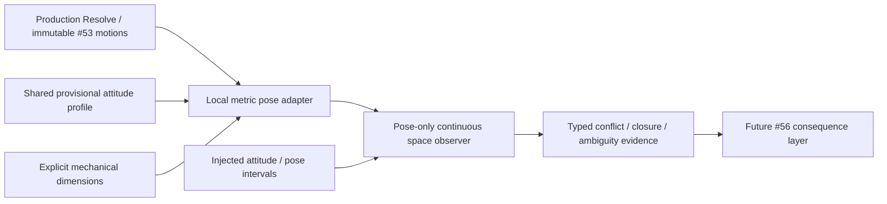

# Physical motorcycle occupancy and common-time contested space (#55)

Base: `12cce6f9709f34ea1617d21399d2a615b3f689af` (current main, squash #54).
Status: observation foundation; dimensions/attitude remain **PROVISIONAL** except the sourced legal handlebar range.
Deterministic evidence: [machine-readable scenarios and sensitivity](physical-occupancy-evidence.json).

## Audited architecture and binding boundary

#53 supplies immutable `ResolvedRiderMotion` for moving, fixed, launch and partial-crash paths. Moving nodes adapt `ExecutedSegmentPath`; fixed nodes observe existing longitudinal integration. The sampler interpolates stored local progress and physical offset, with each rider's independent heat-clock origin. #54 ranks bounded Entry/Apex/Exit intents by isolated Full/Lean production replay. This PR changes neither owner.

`ResolvedBikePoses.FromMotion` reads those same nodes and immutable `Track.CornerTopology`. `PhysicalSpaceObserver` attaches only through the existing explicit post-Resolve/pre-Commit observer hook. `Complete()` runs after capture, so it can intersect motions from different simulation steps and segment traversal durations. It never runs in `TrajectoryEvaluator`, normal Decide, or Lean candidate projection. Canonical rider results, motion equality/hashes, diagnostics, surface wear and legacy contacts are unchanged. No production object receives an extra geometry field.

The new dependency is:



This is **not a complete tyre/slip motorcycle dynamics model**. Legacy `0.55 m` decision/contact thresholds, `0.12 s` endpoint eligibility, RNG, LostRhythm/crash and forced movement remain temporary gameplay mechanics. They neither define the new dimensions nor consume the geometry in #55.

## Physical provenance and assumptions

Source audit performed against the FIM 2026 Track Racing Technical Regulations, version 1 updated 10 June 2026. [Official publication page](https://www.fim-moto.com/en/documents/view/2026-1-track-racing-technical-regulations-10062026) and [official PDF](https://www.fim-moto.com/fileadmin/2026_1_TRACK_RACING_Technical_Regulations_10.06.2026.pdf), §01.33 / 33.01, printed p.16: 250/500 cc Track Racing handlebar width is 700–900 mm. The June revision changes §01.67, not this range.

| Quantity | Source/status | Use in #55 |
| --- | --- | --- |
| Handlebar legal range 0.70–0.90 m | **VERIFIED**, FIM 2026 §01.33 | Sensitivity envelope; midpoint is a provisional reference choice |
| Overall mechanical length | **PROVISIONAL**, no authoritative modern 500 cc whole-bike measurement established | Longitudinal capsule extent |
| Chassis/body width | **PROVISIONAL** | Body capsule diameter |
| Handlebar location and tube diameter | **PROVISIONAL** | Transverse capsule location/diameter |
| β peak and phase timing | **PROVISIONAL**, no validated rider yaw telemetry | Independent shared reference attitude |
| Production reference point as mechanical footprint centre | **PROVISIONAL** mapping | Explicit geometric reference, not a measured axle/CG location |

FIM wheelbase limits for sidecars (§01.54) and 85 cc machines (§01.83) were rejected as out-of-class evidence. Historical road-motorcycle dimensions and engine-only manufacturer specifications are not evidence for a modern speedway bike's complete mechanical length. No illustrative large-slide statement is used to calibrate a universal yaw angle. Wheelbase is omitted because this footprint does not need it.

| Central parameter | Lower / reference / upper used in sensitivity | Status |
| --- | --- | --- |
| OverallMechanicalLengthMeters | 1.90 / 2.10 / 2.30 m | PROVISIONAL |
| ChassisBodyWidthMeters | 0.25 / 0.30 / 0.35 m | PROVISIONAL |
| HandlebarWidthMeters | 0.70 / 0.80 / 0.90 m, varied independently | Range VERIFIED, selected value PROVISIONAL |
| HandlebarLongitudinalOffsetMeters | +0.55 / +0.65 / +0.75 m | PROVISIONAL |
| HandlebarTubeDiameterMeters | 0.03 / 0.04 / 0.05 m | PROVISIONAL |
| PeakSlideAngleRadians | 0 / π/6 / π/3 in the production sensitivity | PROVISIONAL; 0 is control |
| SlideBuildStartProgress | reference 0.05 | PROVISIONAL |
| PeakProgress | reference 0.35 | PROVISIONAL |
| StraighteningStartProgress | reference 0.55 | PROVISIONAL |
| StraighteningCompletionProgress | reference 0.95 | PROVISIONAL |

`SpeedwayBikeDimensions.Reference` and `ReferenceBikeAttitude.Neutral` own all defaults. Inputs are immutable and finite/domain-validated. Legal range enforcement belongs to a future ruleset; mathematical geometry can accept other explicitly supplied dimensions. These are an audit menu, not telemetry confidence intervals or contact-count targets. No constant was selected to obtain a preferred number of overlaps.

## Mechanical footprint

The longitudinal body capsule has axis length `L − bodyWidth` and radius `bodyWidth/2`, preserving total mechanical length L. A transverse handlebar capsule has axis length `barWidth − tubeDiameter`, radius `tubeDiameter/2`, and centre `referencePoint + forward * barOffset`. Both rotate with ψ. The geometry allocates no component collection per separation query.

```text
                  transverse bar capsule
                         |  width  |
    rear  (==============+==============)  front
          longitudinal body capsule
                     reference centre --> forward ψ
                        bar centre at +offset
```

Mechanical occupancy contains no rider shoulder, leg, personal space or tactical clearance. A future body envelope may be a separate component/layer. Capsule-axis distance minus both radii is signed separation; the composite result is the minimum of the four ordered component pairs. Positive is clear, zero is touching, negative is overlapping. `PenetrationMeters = max(0, -signedGap)` is the capsule signed-gap depth, not a full rigid-body penetration/impulse solution. Components at the sampled minimum are retained.

## Coordinates, travel and motorcycle direction

All distances are metres; all times are seconds of the heat; internal angles are radians. Counterclockwise yaw is positive; headings normalize to `[-π, π)`. The half-turn interpolation tie deterministically takes the negative shortest arc. `BikeAttitudeSample` independently carries common time, χ, ψ and `β = wrap(ψ−χ)`. `PhysicalBikePose` adds rider id, identified Euclidean frame, position, dimensions and derived footprint.

On a straight, `(x,y) = (straightLength * consumedSegmentProgress, −physicalOffset)`. Positive y is left/inside; offset grows outward. The velocity derivative includes actual lateral change, so diagonal χ is `atan2(−offsetRate, longitudinalRate)`. A stationary straight reaction uses χ=ψ=β=0 at the exact existing gate centre. Inner-edge centres 1.5/4.5/7.5/10.5 m map to reference offsets 0.5/3.5/6.5/9.5 m; no lane rounding is introduced.

Within a complete logical corner, the local centre of curvature is the origin: `r = innerReferenceRadius + physicalOffset`, `θ = (memberOffset + segmentProgress) * segmentAngle`, position `(r cosθ, r sinθ)`. χ comes from the derivative `r' radial + r θ' tangent`, including actual radial movement. All current turn segments use the track's one angular span; therefore `CornerProgress = (memberOffset + segmentProgress)/memberCount` is the algebraic angular/arc projection of existing topology. It stays continuous at Entry/Middle/Exit boundaries; labels do not select angle states. Coordinates are never reconstructed from target lanes, final position alone or mean segment velocity.

Frame ids identify a straight segment or whole logical corner and lap. Positions in unrelated frames cannot be subtracted. There is deliberately no synthetic global stadium, connecting chord or width spline. A separate reference-track tangent is exposed only to remove common forward transport in the contribution diagnostic; it does not orient the footprint or replace actual χ.

## Independent provisional attitude

Straight/reaction β is zero. Corner β is cubic smoothstep from zero between build-start and peak, holds the peak through straightening-start, then smoothstep returns to zero at completion. The neutral peak is 30°, a provisional input. β is independent from speed, `v²/R`, lateral acceleration, lean, rear tyre slip ratio and tyre slip angle. Current constraints do not contain enough tyre information to determine ψ uniquely from χ.

Early `(0,.5,.15,.25,.60)` and late `(.1,.5,.40,.70,1)` profiles in the evidence demonstrate different footprints at identical centres, with tuples `(build, peakRadians, peakPhase, straightenStart, completion)`. A smaller profile is simply a lower peak. Production uses one shared neutral profile for all riders. The resolver consumes `PhysicalPoseInterval`; it has no rider-skill/profile dependency and does not know the attitude's cause. Future injected intervals must supply conservative translation/rotation rate bounds.

> A rider may keep approximately the same centre trajectory while the rotating motorcycle footprint enters another rider's occupied space.

This is demonstrated by I: A and B both translate 20 m parallel with unchanged centre separation. A rotates from 0 to π/2 over the interval, B stays aligned. Both endpoint footprints are clear; an interior footprint overlaps. The 90° controlled sweep is a geometric stress probe, not the default reference peak. K compares identical centre paths with fixed zero versus π/4 yaw; occupied-space conclusions differ. J retains positive translation and rotation contributions simultaneously.

## Common-time continuous algorithm

The adapter creates continuous spans between **existing motion nodes**, plus exact attitude-phase crossings. Common time is `double(StartElapsedTimeSeconds) + LocalTimeSeconds`; travelled metres are never used as a shared longitudinal origin. Reaction endpoints, duplicate-time state events and segment boundaries are temporal cuts. Pair evaluation intersects actual domains using two sorted interval streams across the entire captured heat. A maximum of six unordered four-rider pairs is independent of input collection order; A/B mean ascending rider ids.

Bounding circles conservatively reject contact where centre separation cannot close enough over the interval. Narrow phase evaluates only immutable poses and four capsule pairs. For linear centre/shortest-angle histories, centre velocity is exact and angular speed is bounded by the normalized angle advance. For production polar nodes, radius and angular progress are linear: `|position''| <= rMax*θRate² + 2*|rRate*θRate|`; χ rate is at most `2*|θRate|`. Smoothstep contributes at most `1.5*peak/phaseSpan * progressRate` to ψ rate.

Relative centre-speed bound uses the difference of midpoint velocities plus both acceleration bounds times half duration. Add each footprint's bounding radius times its angular-speed bound to obtain a conservative signed-distance Lipschitz bound L. For an interval with endpoint gaps g0/g1, `min(g0,g1)−L*duration/2` is a lower bound, clamped only by the mathematical minimum `−radiusA−radiusB`. Deterministic left-first adaptive bisection searches for the earliest contact and a pair-wide minimum. The minimum incumbent is shared only inside this unordered pair. Far intervals that cannot improve it avoid extra subdivision. No uniform global timestep or second physics replay exists.

Every compatible interval retains its sampled minimum and conservative lower bound. The **pair-wide** minimum across the complete report is certified within the minimum-gap tolerance when `NumericallyResolved` is true for all searched intervals; individual far-interval sampled minima are not independently refined to that tolerance. Components/time refer to the evaluated minimum; the time of a flat or near-flat minimum need not be unique. Work counts are interval/algorithm counts, not distinct racing incidents.

Bound exhaustion and unresolved tangent intervals are explicit (`NumericallyResolved=false`, `UnresolvedIntervals`); they are excluded from `EligibleForFutureInteraction`. A potential interior tangent must never become a silent clear result. Clear endpoints alone never reject a rotating or crossing candidate.

## Numerical tolerances

| Named value | Value | Purpose |
| --- | --- | --- |
| ContactDistanceMeters | 1e−6 m | Numerical touching tolerance, not clearance/body inflation |
| MinimumSeparationToleranceMeters | 1e−4 m | Pair-minimum branch bound termination |
| TimeToleranceSeconds | 1e−7 s | Earliest-contact bracket and common-time equality |
| AngleToleranceRadians | 1e−9 rad | Documented angle equality precision; interpolation uses wrap, not scalar epsilon jumps |
| BroadPhasePaddingMeters | 1e−8 m | Conservative rejection pad |
| MaximumSubdivisionDepth | 30 | Hard deterministic recursion bound |
| MaximumEvaluationsPerInterval | 4096 | Hard narrow-phase budget; exhaustion remains unresolved |
| ParallelClassificationAngleRadians | 0.1 rad | Direction category for diagnostics only; never a contact tolerance |

The new JSON writer rounds presentation doubles to 10 decimal places (at most 5e−11 in displayed units). Raw geometry and tests still use double values; this does not feed physics or change any existing calibration/fingerprint. New Windows/Ubuntu evidence compares canonical bytes at that presentation precision. The independent #54 audit still compares complete raw structured values and IEEE bits exactly.

## Translation/rotation contributions and labels

At the first-touch onset knot interval, compare stored start/end poses only. For nearly parallel reference-track tangents, remove the minimum shared positive forward transport so two bikes moving together are not assigned fictitious longitudinal encroachment. Then measure signed gap reduction for A translation with its old orientation and frozen B, A rotation at its old centre and frozen B, and both corresponding B cases. Actual closure and the nonadditive residual are also retained. Contributions can be negative (opening space), and they are an approximate geometric decomposition, not conserved forces, blame or additive credit.

Flags distinguish RearClosing, A/B translation, A/B rotation, A/B mixed, MutualConvergence, CrossingPaths, ParallelOverlap and BoundaryAmbiguous. RearClosing uses physical relative longitudinal position and velocity; crossing uses lateral-order reversal across the interval. Existing overlap with zero onset change is ParallelOverlap. A closing contribution above numerical contact tolerance supports its corresponding flag. Relative position and relative velocity at the onset are preserved for #56. The onset's whole meaningful knot interval is used, not an almost-zero root bracket. Equivalent subdivision tests protect labels/contact time/minimum, while raw contribution magnitudes are interval-dependent and should not be mistaken for whole-manoeuvre strength.

## Boundaries and incomplete frame coverage

**NEVER sweep FromPhysicalOffsetMeters to ToPhysicalOffsetMeters.** The adapter only traverses positive-time adjacent stored nodes inside a consumed frame. Entry/Exit width reinterpretations create different straight/corner frames at the same heat time, not displacement. Duplicate-time legacy position changes are also not swept.

Overlap already present at the start of a discontinuous span is conservatively BoundaryAmbiguous and quarantined through subsequent continuously overlapping knots until a clear start is observed. It is not accepted as real translation, rotation or contact. At a frame mismatch, return typed `FrameCoverageGap` with both frame ids and common-time interval; its kind is BoundaryAmbiguous and it is ineligible for #56. There is no invented distance or contact point for such a gap.

Consequently “no observed eligible conflict” with coverage gaps is **not proof of complete all-time clearance**. Straight/corner straddling riders need a future physically supported boundary chart/transition model for that interval. This limitation is inherited from #53's coarse segment-local width geometry and stays visible rather than being replaced with a fake world map. Continuous intervals within a shared corner include riders in different turn subsegments and use their actual independent arrival times.

## Deterministic scenarios and acceptance evidence

`PhysicalSpaceTests` contains focused A–T controls, executed again in Windows/Ubuntu determinism CI. The generated appendix below records scenario numbers, all six production start/first-bend pairs, sensitivity and work. Different-lane C uses physical overlap irrespective of lane identity; same-lane B stays safe due to longitudinal distance. Geometry intentionally accepts no Lane parameter.

| Case | First touch s | Pair minimum m | Geometric conclusion |
| --- | ---: | ---: | --- |
| A | none | 2.2000000 | No observed eligible conflict |
| B | none | 2.9000000 | No observed eligible conflict |
| C | 0.0000000 | -0.1700000 | ParallelOverlap |
| D | 0.2899999 | -0.3000000 | RearClosing, AEncroachesByTranslation |
| E | 0.5999995 | -0.3000000 | AEncroachesByTranslation |
| F | 0.5999995 | -0.3000000 | BEncroachesByTranslation |
| G | 0.7333331 | -0.3000000 | AEncroachesByTranslation, BEncroachesByTranslation, MutualConvergence |
| H | 0.3999999 | -0.3000000 | AEncroachesByTranslation, BEncroachesByTranslation, MutualConvergence, CrossingPaths |
| I | 0.1047091 | -0.3000000 | AEncroachesByRotation |
| J | 0.4006876 | -0.2201244 | AEncroachesByTranslation, AEncroachesByRotation, AEncroachesMixed |
| K-zero | none | 0.1000000 | No observed eligible conflict |
| K-yaw | 0.0000000 | -0.2863961 | ParallelOverlap |

All controlled cases are numerically resolved. D touches at approximately `(5−2.10)/10 = 0.29 s`. I/J distinguish rotation-only and mixed closure.

| Required case | Additional tested evidence |
| --- | --- |
| L | Early/late profiles produce different ψ/footprints at identical centres; profile samples are in JSON |
| M | Four stationary production gate centres; six pairs clear throughout common reaction |
| N | Genuine production launch convergence, first-bend capture and unchanged consequences |
| O | 0.75 m separation maps through different normalized straight/turn widths with identical mechanical gap |
| P/Q | Both actual width-boundary directions split unswept frames; ambiguity quarantines subsequent overlapping knots |
| R | Controlled and actual four-rider/four-lap reversed collections return exactly equal diagnostics |
| S | D/G/H/I/J at an added equivalent 0.37 s node preserve labels, first touch within 2e−7 s and min within 1e−4 m |
| T | π−0.01 → −π+0.01 interpolates through −π with 0.02 rad sweep, no spurious revolution |

Production K-crossing has first physical touch at 0.5816524 s, before centreline intersection. It still produces its unchanged legacy events.

| Start/first-bend pair | First eligible time s | Min gap m | Min time s | A translation / rotation m | B translation / rotation m | First classification | Boundary intervals / coverage gaps |
| --- | ---: | ---: | ---: | ---: | ---: | --- | --- |
| 1–2 | 1.3345104 | -0.3000000 | 1.7940948 | 0.0109309 / 0.0000000 | -0.0190137 / 0.0000000 | AEncroachesByTranslation | 7 / 1 |
| 1–3 | none observed | 0.3069720 | 7.1556736 | - | - | No observed eligible conflict | 0 / 1 |
| 1–4 | none observed | 4.0982967 | 1.8416817 | - | - | No observed eligible conflict | 0 / 0 |
| 2–3 | none observed | 1.6353340 | 1.4412615 | - | - | No observed eligible conflict | 0 / 1 |
| 2–4 | none observed | 4.1501554 | 1.8416828 | - | - | No observed eligible conflict | 0 / 1 |
| 3–4 | none observed | 1.6502127 | 1.8416828 | - | - | No observed eligible conflict | 0 / 1 |

This real fixture includes all four physical gates, first straight and the complete first logical corner. Negative B contribution means that the one-factor frozen-pose counterfactual opens space; the actual joint motion has its own positive closure and nonadditive residual. A missing eligible time with a coverage gap is not an all-time clearance certificate.

| Sensitivity group | Cases | Conflicting / clear | Conclusion |
| --- | ---: | ---: | --- |
| A | 27 | 0 / 27 | robust safe across menu |
| B | 27 | 0 / 27 | robust safe across menu |
| C | 27 | 27 / 0 | robust conflict across menu |
| I | 27 | 18 / 9 | assumption dependent |
| J | 27 | 18 / 9 | assumption dependent |
| production-first-bend-1/3 | 27 | 0 / 27 | robust safe across menu |

The 135 controlled combinations vary three independent bar widths, three body/length/location bundles and three yaw sweeps. The 27 production first-bend 1/3 combinations vary the same dimensions/bar widths with the actual smooth neutral profile peak 0/30/60°. Zero yaw removes the rotation mechanism. These observations neither fit telemetry nor imply empirical contact probabilities.

| Acceptance question | Answer and evidence |
| --- | --- |
| 1 | YES — typed χ and ψ are independent; K and injected interval tests |
| 2 | YES — cubic smooth profile spans whole logical corner |
| 3 | YES — continuity checks include both 1/3 and 2/3 labels |
| 4 | YES — K-zero versus K-yaw at identical centres |
| 5 | YES — I, clear endpoints and interior rotation contribution |
| 6 | YES — D/E/F with fixed ψ |
| 7 | YES — J typed mixed flag and four raw contributions/residual |
| 8 | YES — C mechanical overlap independent from discrete lanes |
| 9 | YES — B separated by physical longitudinal distance |
| 10 | YES — H/I interior contact and genuine production K-crossing |
| 11 | YES — shifted domains and whole-heat interval intersection; frame gaps are explicit |
| 12 | YES — M exact stationary four-gate centres |
| 13 | YES — P/Q actual production boundaries plus quarantine regression |
| 14 | YES — R and real four-rider/four-lap diagnostics equality |
| 15 | YES — resolver consumes only immutable poses/bounds/dimensions; no RiderProfile/skills input |
| 16 | YES — source dependency audit and exact enabled/disabled heat comparison; no RNG entry point |
| 17 | YES — #54 production/projection source unchanged, complete fingerprint and Full/Lean CI retained |
| 18 | YES — exact heat/classification/state/morale/wear/log comparisons and unchanged historical guards |
| 19 | YES — bounded four-lap benchmark below; no dense global grid |
| 20 | YES — L and public named profile/immutable interval extension contract |

## Performance protocol

`physical-occupancy-performance` captures an actual four-rider/four-lap Motoarena heat once with shared fixed convergence intents, then observes the same immutable spans after one warmup over five repeats. It reports heat+capture time/allocations separately from resolver time/allocations. Main-thread `GC.GetAllocatedBytesForCurrentThread` is valid because this geometry fixture has no parallel decision workers. No wall-clock CI assertion is added. Algorithmic counters are deterministic; runtime and allocation observations are not checked-in deterministic evidence.

Measured desktop Release run (.NET 8 runtime; timing may vary under concurrent validation): 5964 captured pose intervals, six pairs, 11183 compatible candidate intervals and 6297 explicit frame-gap intervals. 11080 intervals reject contact broadly; 31575 narrow evaluations, 9209 subdivisions and 74 first-touch/root iterations. 68 overlapping/contact intervals include continuing overlap and boundary diagnostics; they are not 68 distinct collisions. Unresolved intervals: 0.

Resolver repeats: 68.163, 65.618, 62.596, 63.293, 51.148 ms; median 63.293 ms. Mean resolver allocations: 26.510 MB. Heat plus rich capture: 113.859 ms / 5.798 MB. This is approximately 2.82 evaluations per compatible **meaningful production interval**, not thousands of artificial fixed-time samples per interval. Exact independent #54 projection remains outside this observer cost.


## Reproduction, historical freeze and limitations

```text
dotnet restore
dotnet build -c Release --no-restore -warnaserror
dotnet test -c Release --no-build
python -m unittest discover -s tests/calibration -p 'test_*.py'
python tools/ci/check-shards.py <scratch>/discovery
dotnet run --project src/Sandbox -c Release --no-build -- physical-occupancy-report <scratch>
dotnet run --project src/Sandbox -c Release --no-build -- physical-occupancy-performance <scratch>
git diff --check
```

Regenerate new evidence byte-for-byte and compare to the checked-in file. Re-run existing #53/#54 reports only into scratch space and compare frozen bytes. Existing historical documents/JSON/manifests are unchanged. Observer enabled/disabled tests compare exact classification, final rider position/speed/morale, decisions/logs/legacy events, surface changes and every final raw surface cell, including Adaptive. Four-lap reversed collection diagnostics are also exactly compared.

Not implemented: tyre forces/slip/lean integration; rider-specific attitude skill; shoulder/limb envelope; safety margin; collision impulse; holding/yielding/forced-wide behaviour; aggression/strength/racecraft; traffic-aware #54 projection; speed loss/recovery/crash consequences; new RNG; calibrated real β telemetry; a physically validated straight/corner width transition. The reference point and mechanical dimensions remain provisional. Geometry does not validate real race contact frequency.

## Contract for PR #56

Consume `PhysicalBikePose` (common-time metric position, χ, ψ, β and reference tangent), `BikeFootprint`/dimensions, `ContestedSpaceEvent`, signed separation/components, translation/rotation contributions including their residual, relative position/speed and numerical/frame validity. Supply rider-specific immutable attitude intervals with meaningful knots and conservative rate bounds through `PhysicalPoseInterval`, or vary named `ReferenceBikeAttitude` phases. The collision engine consumes those poses without knowing their cause.

Only numerically resolved events with `EligibleForFutureInteraction=true` may enter a consequence layer. BoundaryAmbiguous and coverage gaps need explicit treatment and must never silently become physical collisions. #56 can then decide hold, yield, force wider, fight for space, body versus mechanical contact, lose rhythm, recover or fall from rider characteristics. It owns deliberate replacement of the legacy consequence layer and any validated boundary geometry adapter; it need not rewrite capsule separation or continuous detection.

**PR #55 establishes physical occupied-space and bike-attitude geometry only. Rider-vs-rider tactical/skill resolution remains PR #56.**
